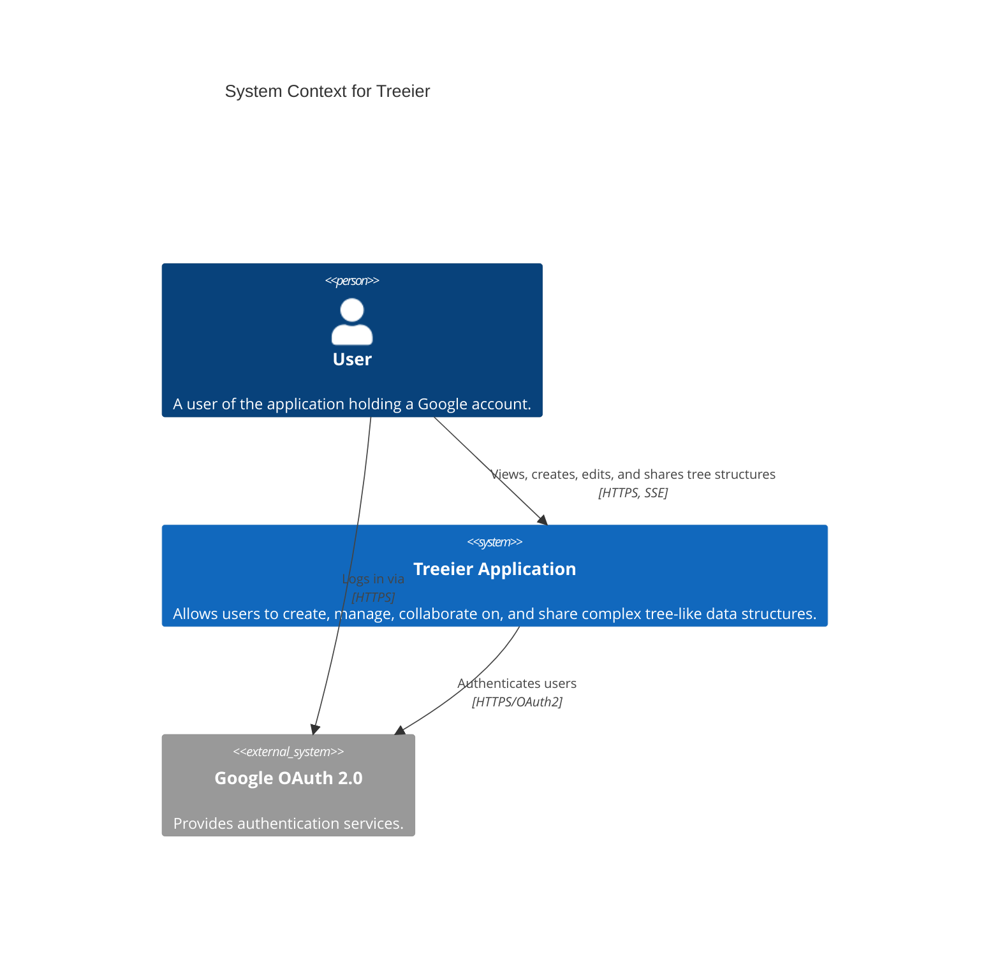
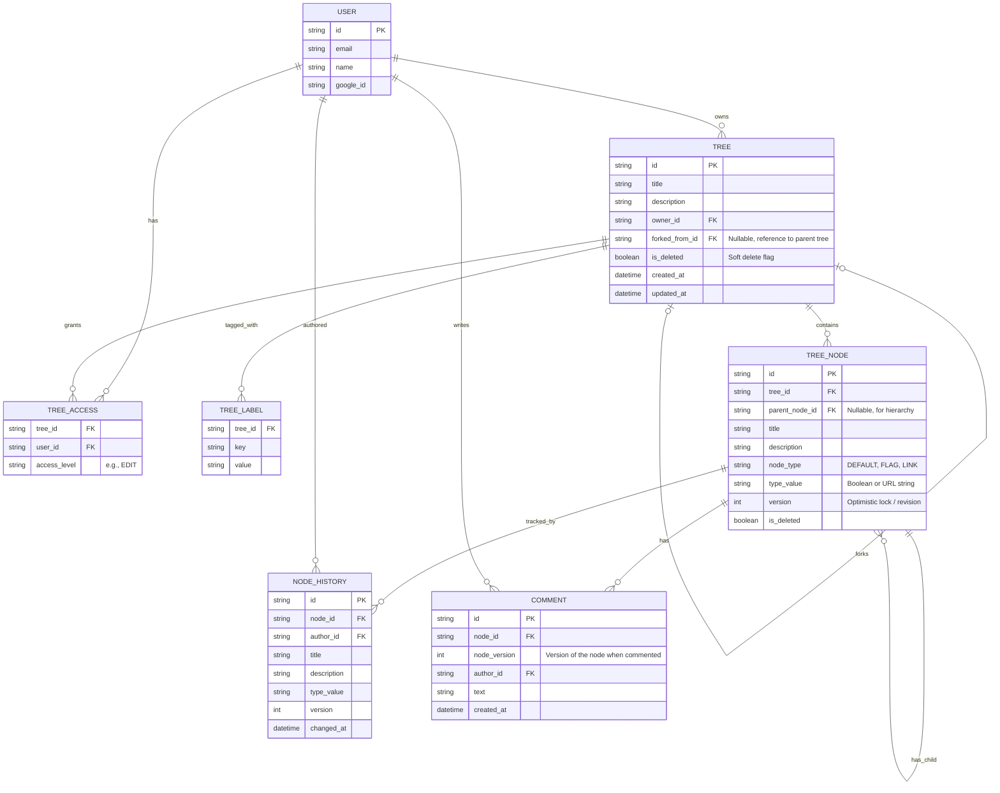

# System Diagrams

## High-Level C4 Context Diagram

```mermaid
C4Context
    title System Context for Treeier

    Person(user, "User", "A user of the application holding a Google account.")
    System(treeier, "Treeier Application", "Allows users to create, manage, collaborate on, and share complex tree-like data structures.")
    System_Ext(google_oauth, "Google OAuth 2.0", "Provides authentication services.")
    
    Rel(user, treeier, "Views, creates, edits, and shares tree structures", "HTTPS, SSE")
    Rel(treeier, google_oauth, "Authenticates users", "HTTPS/OAuth2")
    Rel(user, google_oauth, "Logs in via", "HTTPS")
```

## Entity Relationship Diagram

```mermaid
erDiagram
    USER {
        string id PK
        string email
        string name
        string google_id
    }
    
    TREE {
        string id PK
        string title
        string description
        string owner_id FK
        string forked_from_id FK "Nullable, reference to parent tree"
        boolean is_deleted "Soft delete flag"
        datetime created_at
        datetime updated_at
    }

    TREE_ACCESS {
        string tree_id FK
        string user_id FK
        string access_level "e.g., EDIT"
    }

    TREE_LABEL {
        string tree_id FK
        string key
        string value
    }
    
    TREE_NODE {
        string id PK
        string tree_id FK
        string parent_node_id FK "Nullable, for hierarchy"
        string title
        string description
        string node_type "DEFAULT, FLAG, LINK"
        string type_value "Boolean or URL string"
        int version "Optimistic lock / revision"
        boolean is_deleted
    }

    NODE_HISTORY {
        string id PK
        string node_id FK
        string author_id FK
        string title
        string description
        string type_value
        int version
        datetime changed_at
    }

    COMMENT {
        string id PK
        string node_id FK
        int node_version "Version of the node when commented"
        string author_id FK
        string text
        datetime created_at
    }

    USER ||--o{ TREE : owns
    USER ||--o{ TREE_ACCESS : has
    TREE ||--o{ TREE_ACCESS : grants
    TREE ||--o{ TREE_LABEL : tagged_with
    TREE |o--o| TREE : forks
    TREE ||--o{ TREE_NODE : contains
    TREE_NODE ||--o{ TREE_NODE : has_child
    TREE_NODE ||--o{ NODE_HISTORY : tracked_by
    TREE_NODE ||--o{ COMMENT : has
    USER ||--o{ NODE_HISTORY : authored
    USER ||--o{ COMMENT : writes
```
